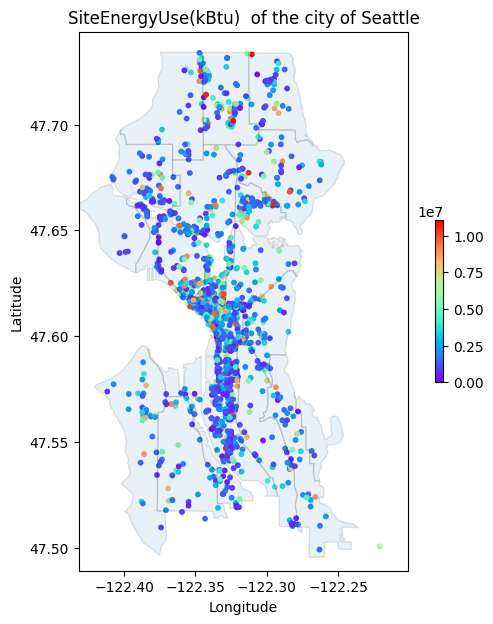
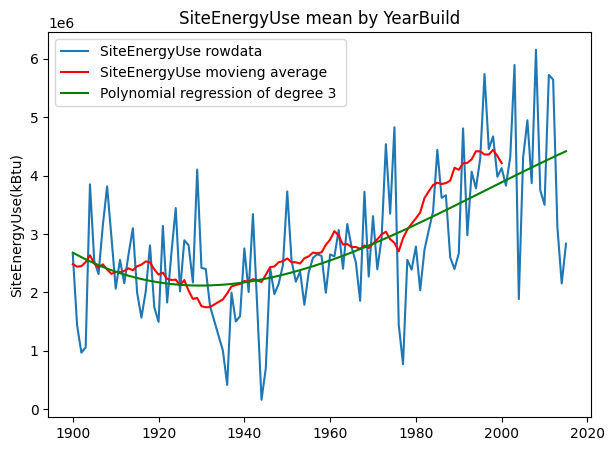

# ⚡️ Electricity and Carbon Emission Prediction 🌎

Welcome to the **Electricity and Carbon Emission Prediction** project, my second data science project that aimed at predicting electricity consumption and carbon emissions based on the Seattle housing dataset. Notebooks are in English. For further details, refer to the presentation slides in French.

##  EDA and data cleaning

- **Missing values and filtering** for non-residential buildings.
- **Analyzing effects** of Location, property type, and build year on consumption.
- **Selecting** the most informative variables for later prediction.

Visualization Examples:

Relation between the building year and the energy consumption.  : 

Very few buildings were build during first and second world war and the second oil shock (1978-79) data from these year are not representative. 
There is a clear difference between buildings build before 1980 and building build after 1990 in term of energy consumption. 